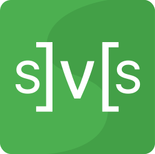

### Hi there, I'm Irwin Arruda 🧑‍💻

- 🖥 I’m currently working as a Software Engineer at [Way Data Solution](https://waydatasolution.com.br/ "Way Data's home page").
-  I've contributed to the open-source project [SETE](https://github.com/marcosroriz/sete-web "SETE's github page"). The project is funded by FNDE (Fundo Nacional de Desenvolvimento da Educação) and helps cities managing school transportation.
-  My primary JavaScript library is [React](https://reactjs.org/ 'Reactjs Home page') but I also like other modern solutions such as [Solid JS](https://www.solidjs.com/), [Svelte](https://svelte.dev/), and [Vue](https://vuejs.org/).
-  [NextJs](https://nextjs.org/ 'NextJs Home page') is the React's Meta-Framework I'm currently focused on.
-  I enjoy to think a lot about state management and even created my own solution based on existing libraries. [Mobx Simple Store](https://github.com/irwinarruda/mobx-simple-store).
-  Module Federation is a subject that I studied a lot, you can check out my findings at [Study on Micro Front-ends](https://github.com/irwinarruda/study-on-micro-frontends)

   
  

    
    
  

### Contact me

